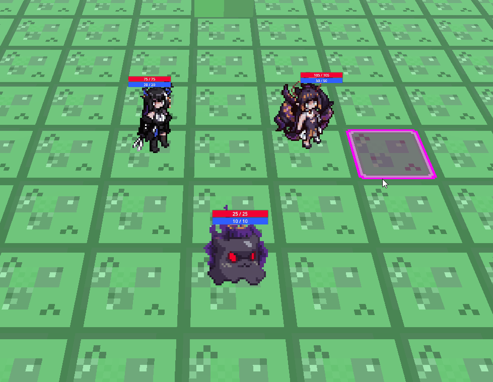

# Godot Turn Based Ability System
A basic work in progress ability system for turn based games.

## Features
* Attributes
* Ability
* Effects

## How to use

Clone into folder in the addons folder.
```bash
git submodule add -f ssh://git@git.tako.place:9022/takotori/godotabilitysystem.git ./addons/gtbas
 ```
p.s: Don't use this for real, at best for inspiration for your own ability system.

## Showcase

